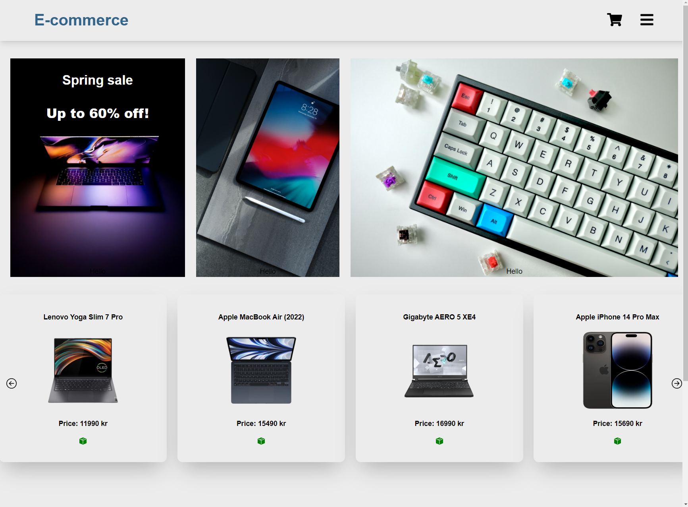
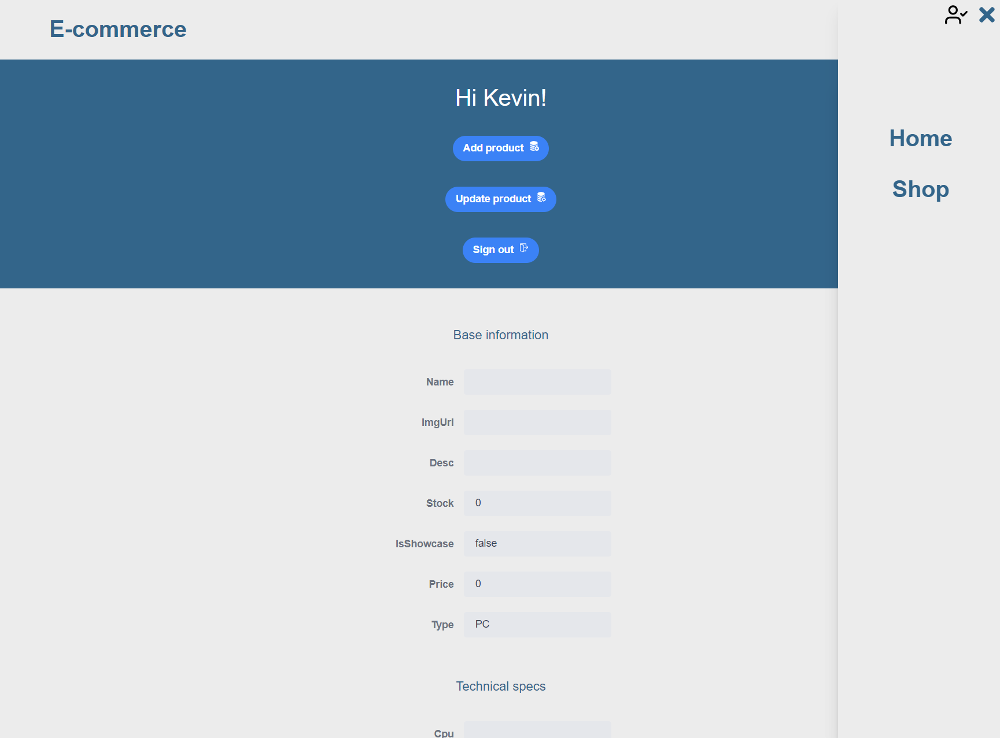

This E-commerce React application represents my effort to explore the world of React libraries and databases. It aims to provide users with a basic shopping experience, offering features such as user account creation, login, and shopping cart functionality. As a learning project, it uses Next.js for front-end development, NextAuth.js for authentication, React for user interfaces, and MongoDB with Mongoose for database management.

## Features

- **User Registration:** Users can create accounts and register on the platform.
- **User Authentication:** Secure user authentication is implemented using NextAuth.js.
- **Login:** Registered users can log in to their accounts.
- **Shopping Carts:** Users can add products to their shopping carts while browsing.
- **Product Listing:** The application displays a list of available products for users to browse.
- **Product Details:** Users can view detailed information about individual products.
- **Payment:** **Note:** Payment processing is not supported in the current version.
- **Responsive Design:** The application is designed to work smoothly on various devices and screen sizes.
- **Encryption:** Before the user-data is stored in the database it is hashed with a salt added using BCrypt.

## Pictures

_Homepage of the E-commerce Application_

_Admin user modifying products in the application_

## Technologies Used

- [Next.js](https://nextjs.org/)
- [NextAuth.js](https://next-auth.js.org/)
- [React](https://reactjs.org/)
- [MongoDB](https://www.mongodb.com/) with [Mongoose](https://mongoosejs.com/)
- [Bcrypt](https://www.npmjs.com/package/bcrypt)
- [React Icons](https://react-icons.github.io/react-icons/)
